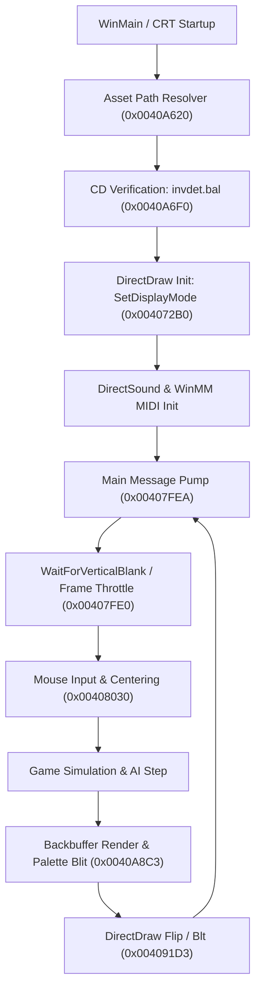

# Baldies (PC Windows 95) — Project Architecture & Reverse Engineering Map

## 1. Overview & Baseline State
- **Game Title**: *Baldies* (1995/1996)
- **Original Platform**: Windows 95 (DirectX 2 / DirectX 3 patch), Open Watcom C/C++ 32-bit x86
- **Current Target**: Modern Windows 11 (64-bit) with Direct3D/OpenGL translation layer
- **Working Baseline Commit**: `master` (`3935b64` - Init)

---

## 2. Directory & Component Structure

```
i:/Baldies/
├── [Executables]
│   ├── baldies.exe          # Original game executable (requires baldies.bal)
│   ├── baldies_win11.exe    # Patched standalone executable (built-in relative path fallback)
│   ├── baldnet.exe          # Network multiplayer executable (DirectPlay 2/3)
│   └── cnc-ddraw config.exe # GUI configuration utility for ddraw wrapper
│
├── [Compatibility & Modernization Layer]
│   ├── ddraw.dll            # cnc-ddraw v7.1.0.0 (DirectDraw -> Direct3D/OpenGL wrapper)
│   ├── ddraw.ini            # Rendering, scaling, FPS limit, and mouse fix configuration
│   ├── DPLAY.DLL            # 32-bit DirectPlay runtime library (for baldnet.exe)
│   └── Shaders/             # Modern pixel shaders (CRT, xBRZ, bilinear, sharpen)
│
├── [Configuration & State]
│   ├── baldies.bal          # Plaintext path pointing to asset root (currently ".")
│   ├── WINBD.CFG            # 22-byte binary configuration (sound, video, options)
│   └── PLAYERS.BAL          # Binary player profile, high scores, and level progression
│
├── [Game Assets]
│   ├── BALS/                # 255 data archives: palettes, sprites, UI, sounds, inventions
│   ├── LVL/                 # 388 level maps (MAP001.BAL - MAP165.BAL, etc.)
│   └── DIRECTX/             # Original DirectX 2 redistributable drivers and utilities
│
└── [Documentation]
    ├── BALDMAN2.TXT         # Original Windows 95 game manual
    └── PROJECT_MAP.md       # This architecture and reverse-engineering map
```

---

## 3. Key Binary Entry Points & Memory Map (`baldies.exe`)

Compiled with **Open Watcom C/C++ 32-bit x86** (`ImageBase: 0x00400000`).

| Section | Virtual Address | Raw File Offset | Raw Size | Purpose |
| :--- | :--- | :--- | :--- | :--- |
| `BEGTEXT` | `0x00401000` | `0x00000400` | `316 KB` | Executable code (game engine, logic, renderer) |
| `DGROUP` | `0x00450000` | `0x0004F000` | `46 KB` | Initialized data, constant strings, vtables |
| `.bss` | `0x0045C000` | `0x00000000` | `56 KB` | Uninitialized runtime state & global buffers |
| `.idata` | `0x0046A000` | `0x0005A600` | `4.5 KB` | Import Address Table (IAT) & descriptors |
| `.reloc` | `0x0046C000` | `0x0005B800` | `43 KB` | Base relocations |
| `.rsrc` | `0x00477000` | `0x00066200` | `577 KB` | Win32 dialogs, splash bitmaps, icons |

### Key Code Routines & Entry Points



1. **Asset Path Resolver & CD Check (`0x0040A620` - `0x0040A72F`, Raw `0x9A20` - `0x9B2F`)**:
   - `0x0040A63D`: Opens `baldies.bal` using `fopen("baldies.bal", "rb")`.
   - `0x0040A659`: Reads up to 259 bytes (`0x103`) into buffer `0x00461677`.
   - `0x0040A698`: Appends `\LVL\` to construct map path buffer `0x00461A83`.
   - `0x0040A6AA`: Appends `\BALS\` to construct asset path buffer `0x00461677`.
   - `0x0040A6BC`: Appends `\ANIMS\` to construct animation path buffer `0x00461B86`.
   - `0x0040A6E5`: Executes `sprintf(buf, "%sinvdet.bal", asset_path)`.
   - `0x0040A6F5`: Calls `stat()` on `invdet.bal`. If not found (`-1`), pops dialog `"Please Insert Baldies CD."` at `0x0040A70C`.
   - *Patched in `baldies_win11.exe`*: Bypasses `baldies.bal` file read and directly sets `0x00461677` to `.` (`0x2E, 0x00`).

2. **DirectDraw Initialization & Mode Selection (`0x004072B0` - `0x00407380`, Raw `0x66B0` - `0x6780`)**:
   - `0x004072EF`: Calls `IDirectDraw::SetDisplayMode(320, 240, 8)`.
   - `0x0040735E`: Calls `IDirectDraw::SetDisplayMode(640, 480, 8)`.
   - If non-zero (`DDERR_UNSUPPORTED`), formats string via `0x00406FE5` and calls `LogErrorAndExit(0x004078C3)`, writing `DDERR.OUT`.

3. **Frame Timing & Vertical Blank (`0x00407FE0` - `0x00407FE7`, Raw `0x73E0`)**:
   - Calls `IDirectDraw::WaitForVerticalBlank(1, 0)` via COM vtable `[edx + 0x58]`.
   - Game logic is tick-driven (1 frame = 1 simulation tick) without delta-time scaling.
   - Throttled externally by `ddraw.ini` (`maxgameticks=30`, `limiter_type=4`, `vsync=true`).

4. **Mouse Coordinate & Centering Routine (`0x00408030` - `0x004081AC`, Raw `0x7430` - `0x75AC`)**:
   - `0x00408049`: Calls `GetCursorPos(&pt)`.
   - `0x00408064`: Calculates relative delta: `dx = (pt.x - width/2) / 2`, `dy = (pt.y - height/2) / 2`.
   - `0x0040819C`: Calls `SetCursorPos(width/2, height/2)` to lock the mouse to screen center.
   - Handled in `ddraw.ini` via `center_cursor_fix=true` and `hook_peekmessage=true`.

5. **Audio & MIDI Stream Sequencer (`0x00403500` - `0x00404500`)**:
   - `DirectSoundCreate` at IAT `0x0046A638` for digitized sound effects.
   - `WINMM.dll` MIDI stream API (`midiStreamOpen`, `midiStreamOut`, `midiOutShortMsg`) at IAT `0x0046A414` - `0x0046A43C` for music soundtrack playback.

6. **Network Multiplayer Subsystem (`baldnet.exe`)**:
   - Imports `DPLAY.DLL` Ordinals 1 and 2 (`DirectPlayCreate` and `DirectPlayEnumerateA`).
   - Uses IPX/SPX and modem/serial DirectPlay service providers for peer-to-peer multiplayer.

---

## 4. Data Flow

### A. Initialization & Asset Loading Flow
```
baldies.exe
 │
 ├── 1. Read 'baldies.bal' (or patched '.') -> Path buffers (0x461677)
 ├── 2. Verify 'BALS/invdet.bal' exists (CD check pass)
 ├── 3. Read 'WINBD.CFG' (restore audio volume, screen resolution)
 ├── 4. Read 'PLAYERS.BAL' (load player names, unlocked levels)
 ├── 5. Initialize DirectDraw via 'ddraw.dll' (cnc-ddraw D3D9/D3D11 back-end)
 ├── 6. Create 320x240 / 640x480 primary surface & backbuffer
 └── 7. Display splash dialog -> Transition to game window
```

### B. Frame & Simulation Loop Flow
```
Game Loop (Every Tick: 33.3ms / 30 FPS)
 │
 ├── 1. PeekMessageA (Throttled by limiter_type=4 to 30 ticks/sec)
 ├── 2. Dispatch Windows messages (WM_KEYDOWN, WM_LBUTTONDOWN, etc.)
 ├── 3. GetCursorPos & SetCursorPos (Virtual center handled by center_cursor_fix)
 ├── 4. Simulation Update:
 │       - Unit pathfinding & tasks (Workers, Builders, Soldiers, Scientists)
 │       - Building construction & population growth
 │       - Inventions & traps (mines, grenades, helicopters)
 │       - Enemy AI state machine
 ├── 5. Render Scene:
 │       - Draw terrain tiles from MAPxxx.BAL into 8-bit backbuffer
 │       - Blit unit and structure sprites from BALS archives
 │       - Update animated palette entries (water, fire, indicators)
 └── 6. Flip / Blt to Primary Surface -> WaitForVerticalBlank -> Repeat
```

### C. Persistence Data Flow
```
Player Actions (Level finish / Config change / Exit)
 │
 ├── WINBD.CFG  <-- Writes 22 bytes binary settings (display, music/SFX volume)
 └── PLAYERS.BAL <-- Writes 246 bytes binary profile record (player name, level state)
```

---

## 5. File Formats & Asset Dependencies

### `.BAL` File Classification

| Category | File Examples | Typical Size | Internal Structure |
| :--- | :--- | :--- | :--- |
| **Palettes** | `BALS/BTPAL.BAL`, `CREDPAL.BAL` | 768 bytes | Uncompressed raw 256-color palette (256 * 3 bytes: R, G, B; 0-255 values) |
| **Tile Maps** | `LVL/MAP001.BAL` - `MAP165.BAL` | 25 - 150 KB | Uncompressed 16-bit tile index grid (`128x100` or custom), tile attributes |
| **UI & Bitmaps**| `BALS/ADV320.BAL`, `CLOUDS.BAL` | 30 - 100 KB | Raw 8-bit paletted pixel buffers (width * height bytes) |
| **Definitions**| `BALS/invdet.bal` | 1,632 bytes | Invention definitions (`LANDMINE`, etc.) and research tech trees |
| **User Profile**| `PLAYERS.BAL` | 246 bytes | Fixed-length player profile record with null-padded strings and unlock flags |
| **Config** | `WINBD.CFG` | 22 bytes | Binary configuration block (sound, screen mode, difficulty) |

---

## 6. Modernization & Compatibility Configuration Reference

Defined in [ddraw.ini](file:///i:/Baldies/ddraw.ini):

| Setting | Configured Value | Purpose |
| :--- | :--- | :--- |
| `windowed` | `true` | Runs in windowed mode (avoids Windows 11 exclusive display crashes) |
| `maintas` / `aspect_ratio` | `true` / `4:3` | Prevents stretching on widescreen displays |
| `width` / `height` | `1280` / `960` (default) | Upscales low-res 320x240/640x480 cleanly on modern monitors |
| `inject_resolution` | `800x600,1024x768,...` | Injects custom resolution presets into DirectDraw enumeration |
| `resolutions` | `2` | Exposes full resolution list to DirectDraw |
| `toggle_borderless` | `true` | Alt+Enter toggles between windowed upscaled and borderless native resolution |
| `keytogglemaximize` | `0x22` (Alt+PgDown) | Maximize window to screen bounds preserving 4:3 |
| `maxfps` | `60` | Caps Direct3D rendering flips |
| `maxgameticks` | `30` | Throttles internal game simulation to authentic 30 ticks/second |
| `limiter_type` | `4` | Hooks `PeekMessageA` to throttle the game loop |
| `center_cursor_fix` | `true` | Virtualizes the game's center-cursor yanking routine |
| `hook_peekmessage` | `true` | Fixes mouse scaling in upscaled windowed mode |
| `vsync` | `true` | Enables hardware vertical synchronization |
| `singlecpu` | `true` | Locks process affinity to CPU 0 to prevent thread race conditions |

---

## 7. Branching & Modification Policy
- **Base Branch**: `master` (`3935b64` - Init) is the verified working reference baseline.
- **Workflow for Enhancements**:
  1. Create a dedicated local branch: `git checkout -b feature/<name>` or `git checkout -b opt/<name>`.
  2. Implement changes, test thoroughly locally.
  3. Validate using the baseline test checklist (no `DDERR.OUT`, 30 FPS pacing, responsive mouse, functional audio/saving).
  4. Only merge to `master` upon explicit confirmation.
